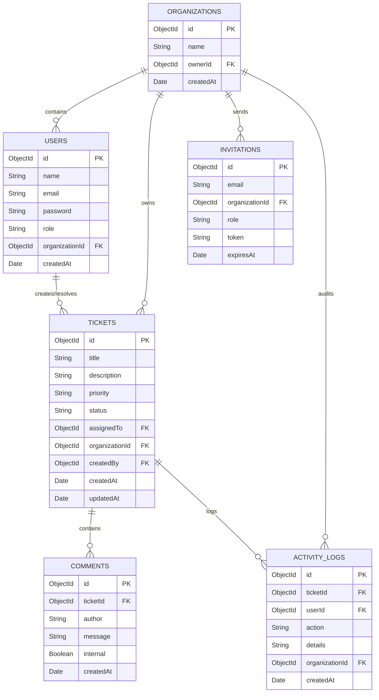
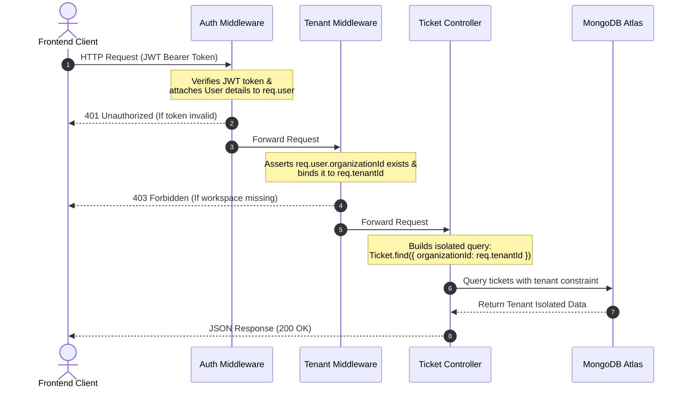

# SupportDesk — Enterprise Multi-Tenant Support Ticketing Platform

SupportDesk is a production-ready, multi-tenant customer support ticketing platform designed with strict query-level data isolation, role-based access control (RBAC), real-time aggregated metrics dashboarding, activity audit logging, and email-based workspace invitations.

Designed as a simplified clone of industry leaders like **Zendesk**, **Freshdesk**, and **Jira Service Management**, the platform focuses on robust SaaS architectures that isolate customer data completely inside isolated workspaces.

---

## 🛠️ Tech Stack

- **Frontend**: React, React Router, Tailwind CSS, Axios, `@tanstack/react-query`, Lucide Icons
- **Backend**: Node.js, Express.js, MongoDB, Mongoose ODM
- **Security**: JSON Web Tokens (JWT), BCrypt.js password hashing
- **Deployment**: Vercel (Frontend), Render (Backend), MongoDB Atlas (Database)

---

## 📊 Database Architecture

The data architecture is structured around multi-tenant isolation. Every user, ticket, comment, invitation, and activity log is bound to an `organizationId`, preventing cross-tenant leakage.



---

## 📡 System Architecture Flow

All client requests must pass through authentication and tenant verification middleware layers before reading or updating isolated database documents.



---

## 🔒 Security & Data Isolation Model

### 1. Query-Level Data Isolation
To prevent the accidental cross-contamination of organization data, SupportDesk applies query-level scoping:
```js
// Example from ticketController.js
exports.getTickets = async (req, res) => {
  const query = { organizationId: req.user.organizationId };
  // ... apply optional filters
  const tickets = await Ticket.find(query);
};
```
No globally accessible routes are provided to fetch tickets across workspaces. Every single DB operation is strictly scoped by `organizationId`.

### 2. State Transition Engine (Ticket Workflow)
SupportDesk enforces strict state-machine logic on ticket status updates to prevent illegal actions (e.g. moving a closed ticket back to open or skipping stages):
```
  Open ──> In Progress ──> Resolved ──> Closed
```
Transitions must conform to the validation map:
```js
const VALID_TRANSITIONS = {
  open: ['in_progress', 'resolved', 'closed'],
  in_progress: ['resolved', 'closed'],
  resolved: ['closed'],
  closed: []
};
```

---

## 📑 API Documentation

All request bodies must contain JSON data. Requests to private routes require a `Authorization: Bearer <JWT_TOKEN>` header.

### Authentication
#### Register User & Organization
- **Endpoint**: `POST /api/auth/register`
- **Request Body**:
  ```json
  {
    "name": "Jane Doe",
    "email": "jane@company.com",
    "password": "strongpassword123",
    "organizationName": "Acme Corp Workspace"
  }
  ```
- **Response (201 Created)**:
  ```json
  {
    "success": true,
    "token": "eyJhbGciOiJIUzI1NiIsIn...",
    "user": { "_id": "60a7d...", "name": "Jane Doe", "role": "owner" },
    "organization": { "_id": "60a7e...", "name": "Acme Corp Workspace" }
  }
  ```

#### Login
- **Endpoint**: `POST /api/auth/login`
- **Request Body**:
  ```json
  {
    "email": "jane@company.com",
    "password": "strongpassword123"
  }
  ```

---

### Ticket Management
#### Get Tickets (Isolated, Search & Filters supported)
- **Endpoint**: `GET /api/tickets`
- **Query Parameters**:
  - `search` (Search text matching title or description)
  - `status` (`open`, `in_progress`, `resolved`, `closed`)
  - `priority` (`low`, `medium`, `high`, `critical`)
  - `assignedTo` (User ObjectId or `unassigned`)
  - `startDate` (ISO YYYY-MM-DD)
  - `endDate` (ISO YYYY-MM-DD)
- **Response (200 OK)**:
  ```json
  {
    "success": true,
    "count": 1,
    "data": [
      {
        "_id": "60a7f...",
        "title": "Email server connection failure",
        "description": "Port 465 times out continuously...",
        "status": "open",
        "priority": "critical",
        "assignedTo": null,
        "organizationId": "60a7e...",
        "createdAt": "2026-06-23T07:22:00.000Z"
      }
    ]
  }
  ```

#### Get Dashboard Analytics
- **Endpoint**: `GET /api/tickets/analytics`
- **Response (200 OK)**:
  ```json
  {
    "success": true,
    "data": {
      "totalTickets": 25,
      "openTickets": 10,
      "inProgressTickets": 5,
      "resolvedTickets": 8,
      "closedTickets": 2,
      "criticalTickets": 3,
      "resolutionRate": 40,
      "statusDistribution": { "open": 10, "in_progress": 5, "resolved": 8, "closed": 2 },
      "priorityDistribution": { "low": 5, "medium": 12, "high": 5, "critical": 3 },
      "trend": [
        { "date": "Jun 17", "created": 3, "resolved": 2 },
        { "date": "Jun 18", "created": 4, "resolved": 1 }
      ]
    }
  }
  ```

---

### Activity Audit & Security Log
#### Get Recent Activities
- **Endpoint**: `GET /api/activity`
- **Response (200 OK)**:
  ```json
  {
    "success": true,
    "count": 2,
    "data": [
      {
        "_id": "60a80...",
        "action": "Status Changed",
        "details": "Status changed from 'open' to 'in_progress' by Karthi",
        "userId": { "name": "Karthi", "role": "agent" },
        "ticketId": { "title": "Email server connection failure" },
        "createdAt": "2026-06-23T07:45:00.000Z"
      }
    ]
  }
  ```

---

## 📝 Resume Bullet Points

- **Designed and developed a multi-tenant customer support platform (SupportDesk)** supporting RBAC and workspace-level data isolation using Node.js, React, and MongoDB.
- **Architected custom tenant-isolation middleware** in Express.js to intercept incoming requests and force query-level containment by `organizationId`, preventing cross-workspace data leaks.
- **Implemented a state-machine workflow transition engine** for tickets (Open -> In Progress -> Resolved -> Closed), preventing invalid status loops and strengthening audit trails.
- **Developed a lightweight analytics engine** utilizing MongoDB aggregate pipelines and native responsive SVG graphing on the frontend, yielding interactive dashboard rendering with zero third-party visual library overhead.
- **Engineered a security-critical audit log feed** tracking status updates, ticket ownership changes, and actions to comply with enterprise compliance logging standards.

---

## 💬 Interview Talking Points

### 1. How did you ensure multi-tenant security?
"I implemented query-level isolation instead of separate databases for cost-efficiency. I built a custom tenant middleware that extracts the organization identifier from the authenticated user's JWT. All Mongoose queries to collections like `Tickets`, `Comments`, and `ActivityLogs` are strictly forced to append `organizationId: req.user.organizationId`. A tenant can never supply their own organization parameter via query string to access another company's records."

### 2. Why did you build custom SVG charts instead of using Chart.js or Recharts?
"In production environments, external UI charting packages introduce heavy npm dependency trees, package version conflicts, and overhead. Building custom SVG graphics in React gives us 100% control over design styles (glowing gradient overlays, SaaS dark theme styling, mobile scaling) and allows GPU-accelerated micro-animations with zero external dependency foot-print."

### 3. How do you handle high concurrent writes to ActivityLogs?
"Activity logging occurs asynchronously and doesn't block client response times. In our current implementation, we execute logs side-by-side with CRUD tasks. In a larger production-scale deployment, we would decouple this by publishing events to a message queue like RabbitMQ or Apache Kafka, permitting log consumers to ingest and write activity records asynchronously to MongoDB without degrading main thread response times."
